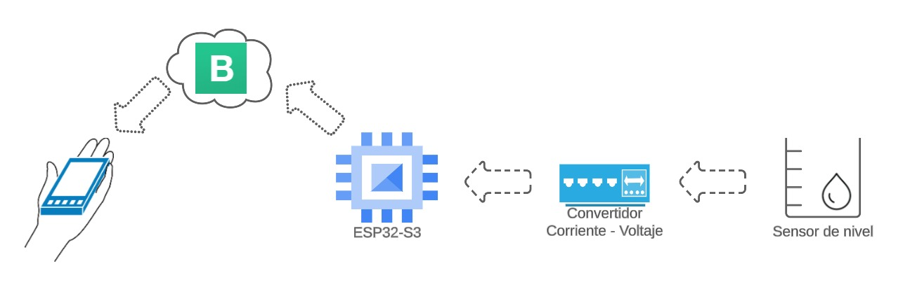
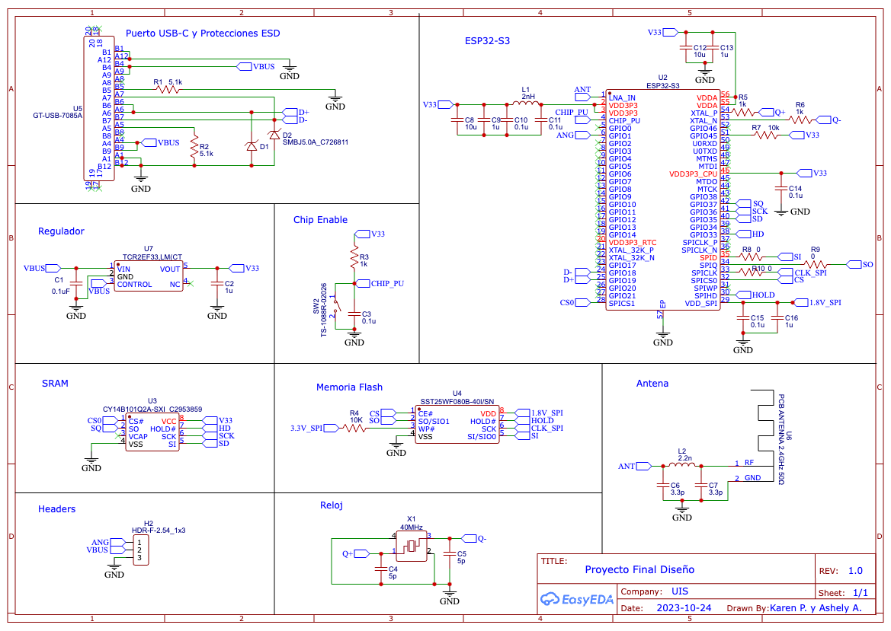
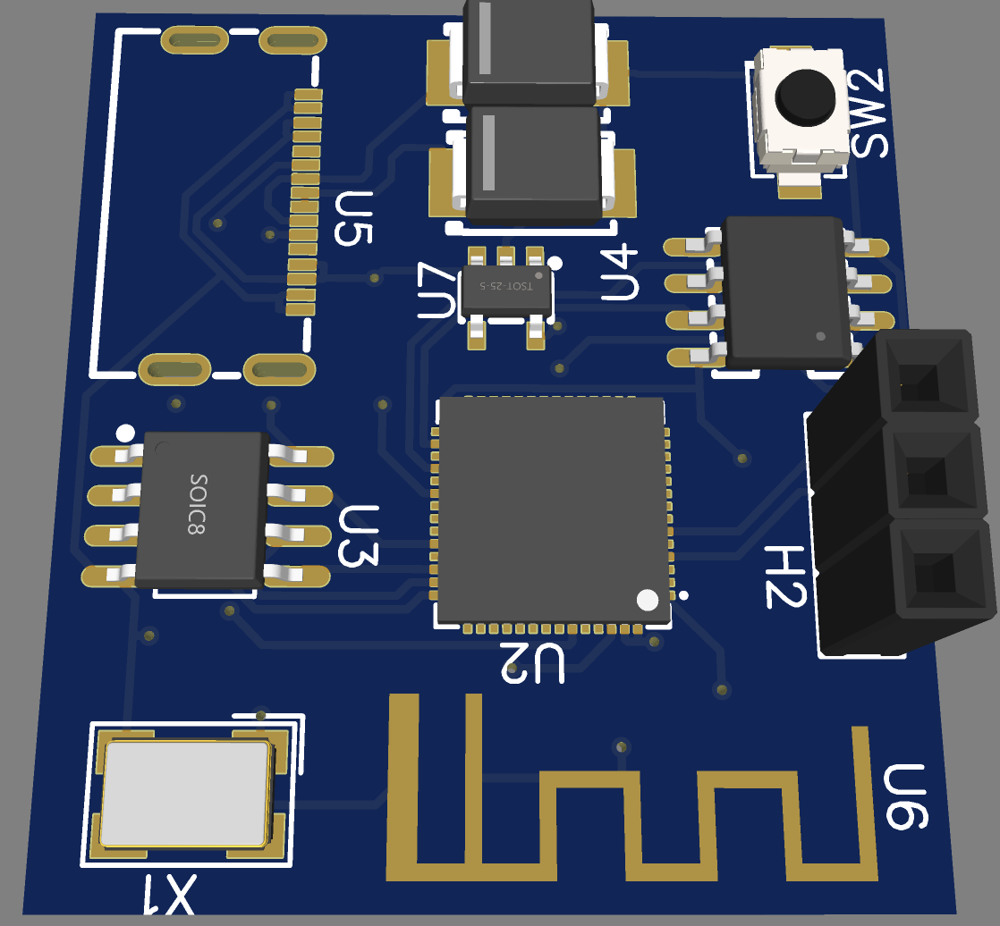

## Proyecto-DSE: Sistema digital que permita medir y transmitir el nivel de forma inalámbrica.
### Descripción:
Diseñar un sistema digital basado en una tarjeta de circuito impreso (PCB) de cuatro capas, capaz de medir de manera inalámbrica el nivel de agua en un tanque subterráneo de dimensiones 3m x 2m x 2m destinado al almacenamiento de agua lluvia. Este sistema permitirá la transmisión de datos a un dispositivo móvil y será alimentado a través de un conector USB tipo C. El rango de medición abarcará desde 0 hasta 2 metros de profundidad.

1. Diagrama funcional del sistema propuesto.

2. Esquemático
   

3. Modelo PCB 3D
  

   
